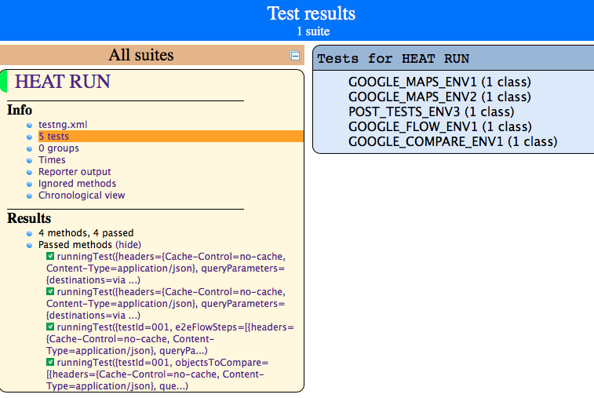

[![Back to Table Of Contents][leftArrow]](../readme.md)

<a name="testResults"></a>
# Collect test results

  * [Output console](#console)
  * [HEAT XML report](#xmlreport)
  * [HEAT Web report](#webreport)


Another important step, after running a Heat test, is to read clear test results and possibly to have a way to document them in a persistent way.
HEAT produces test results in 3 ways, all available after any run.

```bash
mvn test -Denvironment=<ENV> -DlogLevel=<LEVEL> -DheatTest=<TESTCASES>
```

<a name="console"></a>
## Output console

The quickest way to read the execution results is the output console. The content of the test report depends on the selected **logLevel** and it looks like the following:

```bash
> mvn test

...

      ___           ___           ___                 
     /__/\         /  /\         /  /\          ___   
     \  \:\       /  /:/_       /  /::\        /  /\  
      \__\:\     /  /:/ /\     /  /:/\:\      /  /:/  
  ___ /  /::\   /  /:/ /:/_   /  /:/~/::\    /  /:/   
 /__/\  /:/\:\ /__/:/ /:/ /\ /__/:/ /:/\:\  /  /::\   
 \  \:\/:/__\/ \  \:\/:/ /:/ \  \:\/:/__\/ /__/:/\:\  
  \  \::/       \  \::/ /:/   \  \::/      \__\/  \:\ 
   \  \:\        \  \:\/:/     \  \:\           \  \:\
    \  \:\        \  \::/       \  \:\           \__\/
     \__\/         \__\/         \__\/                

12:34:29.956 INFO  [GOOGLE_MAPS_ENV1.001][Example Single Mode Tests][single mode test for new heat #1] -- PASSED
12:34:30.662 INFO  [GOOGLE_MAPS_ENV1.002][Example Single Mode Tests][single mode test for new heat #2] -- PASSED
12:34:33.192 INFO  [GOOGLE_FLOW_ENV1.001][Example Flow Mode Tests][Generic test on flow mode] -- PASSED
12:34:34.868 INFO  [GOOGLE_COMPARE_ENV1.001][Generic Compare Test Suite][Generic Compare for gmaps] -- PASSED
Tests run: 6, Failures: 0, Errors: 0, Skipped: 2, Time elapsed: 9.308 sec - in TestSuite

Results :

Tests run: 4, Failures: 0, Errors: 0, Skipped: 0

[INFO] ------------------------------------------------------------------------
[INFO] BUILD SUCCESS
[INFO] ------------------------------------------------------------------------
[INFO] Total time: 11.617 s
[INFO] Finished at: 2017-07-28T12:34:34+02:00
[INFO] Final Memory: 20M/491M
[INFO] ------------------------------------------------------------------------
```

[![Back to the Top Of Page][upArrow]](#testResults)

<a name="xmlreport"></a>
## HEAT XML report

A persistent file in XML format will be produced in your **target** directory:

```bash
/target/junitReports/HEAT_report.xml
```
it looks like the following:

```xml
<?xml version="1.0" encoding="UTF-8"?>
<heatRun>
  <testsuites numberOfSuites="3">
    <testsuite status="success" skipped="0" name="GOOGLE_MAPS_ENV1" failures="0" tests="2" timestamp="28 Jul 2017 10:34:34 GMT" success="2">
      <testcase status="success" name="001" time="3.057">
      </testcase> <!-- 001 -->
      <testcase status="success" name="002" time="0.7">
      </testcase> <!-- 002 -->
    </testsuite> <!-- GOOGLE_MAPS_ENV1 -->
    <testsuite status="success" skipped="0" name="GOOGLE_FLOW_ENV1" failures="0" tests="1" timestamp="28 Jul 2017 10:34:34 GMT" success="1">
      <testcase status="success" name="001" time="2.483">
      </testcase> <!-- 001 -->
    </testsuite> <!-- GOOGLE_FLOW_ENV1 -->
    <testsuite status="success" skipped="0" name="GOOGLE_COMPARE_ENV1" failures="0" tests="1" timestamp="28 Jul 2017 10:34:34 GMT" success="1">
      <testcase status="success" name="001" time="1.651">
      </testcase> <!-- 001 -->
    </testsuite> <!-- GOOGLE_COMPARE_ENV1 -->
  </testsuites>
</heatRun>
```

[![Back to the Top Of Page][upArrow]](#testResults)

<a name="webreport"></a>
## HEAT Web report

A more readable and interactive way to have your test report is the HEAT web report.
Some HTML web pages will be produced in your **target** directory:

```bash
/target/surefire-reports/index.html
```

it's navigable and it looks like the following:



[![Back to the Top Of Page][upArrow]](#testResults)

[upArrow]: img/UpArrow.png
[leftArrow]: img/LeftArrow.png
