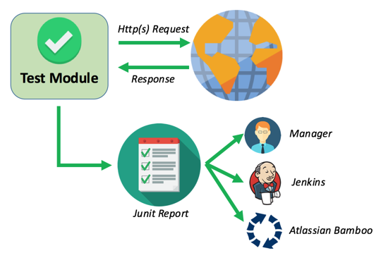
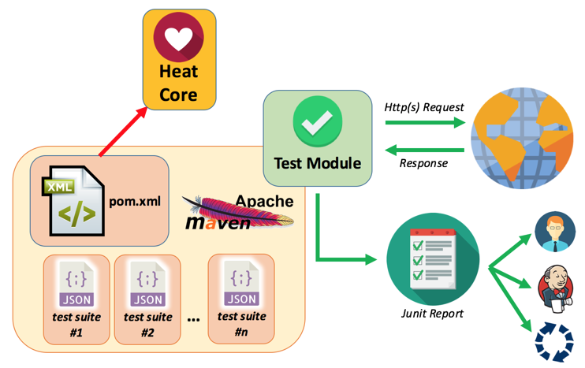

# HEAT - User Documentation

Please, have a look here [code of conduct](code-of-conduct.md)

## Table of Contents
* [WHY do we need a test framework](#why)
* [HEAT - Hotels.com Engine Architecture for Testing](#heat)
* [First General Configuration](doc/readme_firstConf.md)
    * pom.xml
    * environment.properties
* [Single Mode Request](doc/readme_singleMode.md)
    * testng.xml
    * json input file
    * first run
* [Flow Mode Request](doc/readme_flow.md)
  * testng.xml
  * JSON input file
* [Compare Mode Request](doc/readme_compare.md)
  * testng.xml
  * json input file
* [Expectations](doc/readme_expectations.md)
  * A particular element in the json response is equal to a value
  * Check the presence or the absence of a specific field in a response
  * Check if a string contains another string or not
  * Check if an array in the response has a specific size
  * Regular expressions (regexp and regexpToMatch)
  * Checks on the number of occurrences of a string in another string
  * Condition on the execution of a check
* [Placeholders](doc/readme_placeholders.md)
  * Path
  * Preload
  * GetStep
  * Cookie
  * Header
  * SysProp
  * Present / NotPresent
  * Today
  * Wiremock
* [Specific Checks](doc/readme_specificchecks.md)
  * Execution overview
  * Create and register your SpecificCheck
  * JAVA SPI Mapping file
  * How to access to test information during the processing
* [External Custom Modules](doc/readme_extmodule.md)
  * Initial configuration
  * Placeholder Module
  * Placeholder Module Provider
  * Use your Placeholder in a HEAT test
* [Test run and debug with command line](doc/readme_commandLine.md)
  * Select the environment
  * Set the log level
  * Run just the tests you need
* [Collect test results](doc/readme_results.md)
	* Output console
	* HEAT XML report
	* HEAT Web report 

## WHY do we need a test framework 
Do you ever need to write automatic tests on REST APIs? Welcome to our world! Well, there are a lot of commercial products used for that, and they work quite well.

But do you ever need to share your automatic scripts with other people all over the world or simply with other colleagues that need to make some changes in the same moment on the same code line as you? and do you ever need to commit your tests on a common repository? Do you? Good, and how do you manage all your merge tasks? Well, in this case maybe it would be useful go on with the reading....

The most famous commercial products you can find offer some fantastic GUIs that, in terms of "objects" to commit on a repository, are only one file. SoapUI, for example, is only an XML file. JMeter is a JMX file. All those files are made of several hundred of lines, and it is very difficult to see all the differences from a commit to another, and in case of merge, it can be very frustrating, especially if there are conflicts...

So, in order to preserve your offices from unuseful and unproductive bloodshed, please look for other nice testing solutions! Do you need an idea? HEAT!

[![Back to TOC][upArrow]](#table-of-contents)

## HEAT - Hotels.com Engine Architecture for Testing 
Heat is a simple solution based on REST ASSURED framework.

Typically you need a "test module" that, if driven in a proper way, has to produce requests to the application under test and has to receive responses from it. Then it has to make some checks on the retrieved response and to produce a documentation to show the user the result of the tests. This documentation has to be in a format readable and usable with a deploy manager like Jenkins (open source, so, folks, it wins!) or Atlassian Bamboo.

What can change is "only" how you can drive your "test module".

Heat Test Framework makes everything very simple because you will be able to write test cases with a simple json file. So no need to write java code, no need to depend on developers for more complicated tests, no need to pay attention to our friend "checkstyle". It is a simple maven project with a pom linking to a "core" (open source) and a folder with your json files. Each json is a test suite and in each test suite there are several test cases. You can choose to run all the suites, only some of them, or only some test cases among the ones you have written with a command line.

[![Back to TOC][upArrow]](#table-of-contents)

[upArrow]: doc/img/UpArrow.png

# Legal
This project is available under the [Apache 2.0 License](http://www.apache.org/licenses/LICENSE-2.0.html).

Copyright 2015-2018 Expedia Inc.
